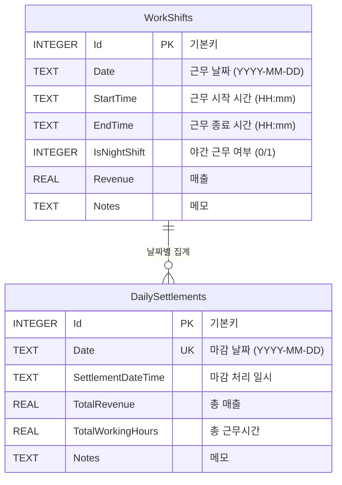

# TaxiManager 데이터베이스 ERD

## Entity Relationship Diagram



## 테이블 상세 정보

### 🕐 WorkShifts (근무시간 테이블)
**목적**: 개별 근무 시간 정보를 저장

| 컬럼명 | 타입 | 제약조건 | 설명 |
|--------|------|----------|------|
| Id | INTEGER | PRIMARY KEY, AUTO INCREMENT | 근무 기록 고유 식별자 |
| Date | TEXT | NOT NULL | 근무 날짜 (YYYY-MM-DD) |
| StartTime | TEXT | NOT NULL | 근무 시작 시간 (HH:mm) |
| EndTime | TEXT | NOT NULL | 근무 종료 시간 (HH:mm) |
| IsNightShift | INTEGER | NOT NULL | 야간 근무 여부 (0: 일반, 1: 야간) |
| Revenue | REAL | NOT NULL | 매출 (기본값: 0) |
| Notes | TEXT | - | 메모 |

**특징**:
- 완전히 유연한 시간 설정 (다음날까지 이어지는 근무 지원)
- 한 날짜에 여러 근무 시간 등록 가능
- 야간 근무 시 자동으로 다음날까지 근무시간 계산

### 📊 DailySettlements (일별마감 테이블)
**목적**: 일별 마감 정보 및 통계를 저장

| 컬럼명 | 타입 | 제약조건 | 설명 |
|--------|------|----------|------|
| Id | INTEGER | PRIMARY KEY, AUTO INCREMENT | 마감 기록 고유 식별자 |
| Date | TEXT | NOT NULL, UNIQUE | 마감 날짜 (YYYY-MM-DD) |
| SettlementDateTime | TEXT | NOT NULL | 마감 처리 일시 |
| TotalRevenue | REAL | NOT NULL | 해당 날짜 총 매출 |
| TotalWorkingHours | REAL | NOT NULL | 해당 날짜 총 근무시간 |
| Notes | TEXT | - | 마감 메모 |

**특징**:
- 날짜별로 유일한 마감 기록 (UNIQUE 제약)
- WorkShifts 테이블의 데이터를 날짜별로 집계
- 마감 처리된 날짜만 매출 통계에 포함

## 🔗 테이블 관계

### 관계 유형: **1:N (One to Many)**
- **WorkShifts** (N) ← **날짜 기준 집계** → **DailySettlements** (1)
- 하나의 날짜(DailySettlements)에 여러 근무시간(WorkShifts)이 대응
- 물리적 외래키는 없지만 Date 컬럼으로 논리적 관계 형성

### 데이터 흐름
```
1. WorkShifts 테이블에 근무시간 여러 번 입력
   ↓
2. 하루 종료 시 DailySettlements에 일별 마감 처리
   ↓
3. 날짜별 총 매출 및 근무시간 자동 계산
   ↓
4. 마감된 날짜만 통계 집계에 포함
```

## 📈 비즈니스 로직

### 근무시간 관리
- **유연한 시간 설정**: 10:00-15:00, 19:00-02:00(다음날) 등
- **야간 근무 지원**: IsNightShift=1일 때 다음날까지 계산
- **메모 기능**: 특별한 상황이나 참고사항 기록

### 매출 관리
- **일별 마감 방식**: 하루 단위로 통합 관리
- **실시간 집계**: 마감 시 자동으로 총 매출/근무시간 계산
- **데이터 무결성**: 마감 후에는 안정적인 통계 제공

### 통계 및 분석
- **월별 조회**: 마감된 날짜 기준으로 집계
- **기간별 통계**: 시작일-종료일 범위의 마감 데이터 분석
- **시간당 매출**: 총매출 ÷ 총근무시간 자동 계산

---
*TaxiManager Database Schema v1.0*